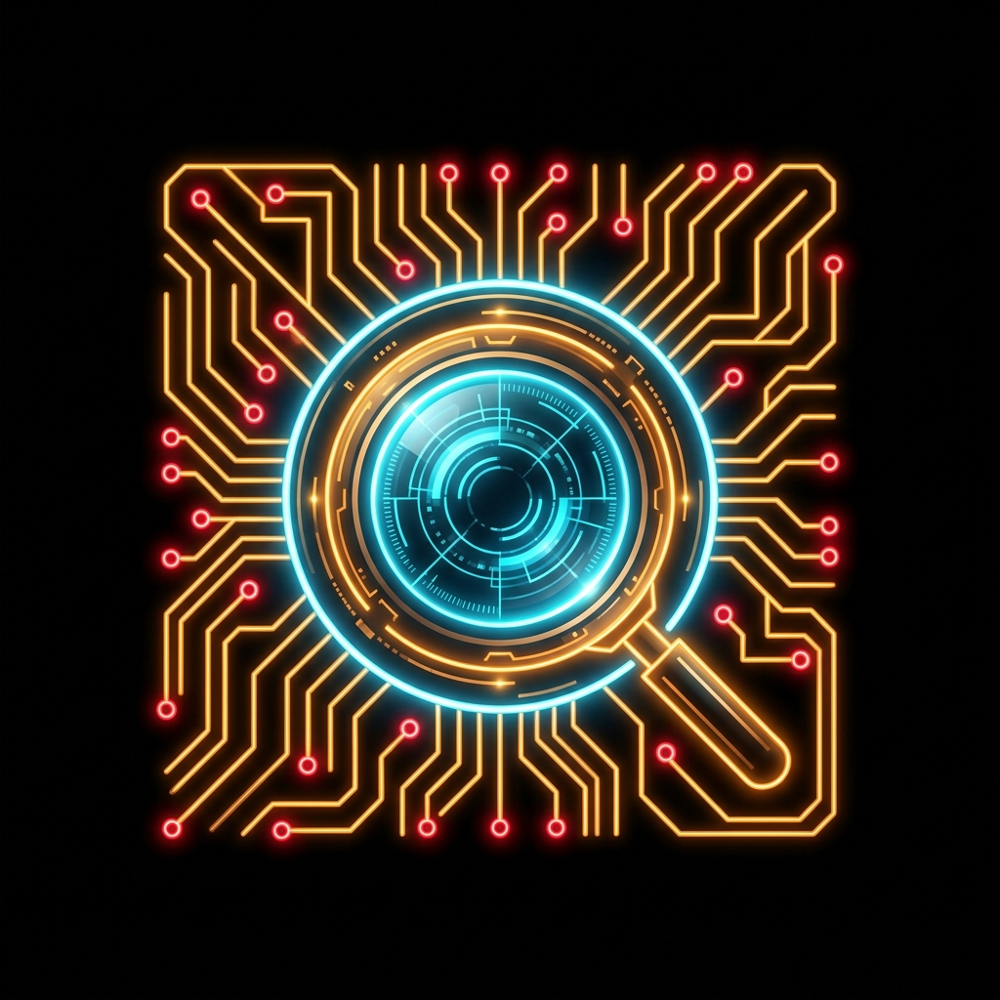
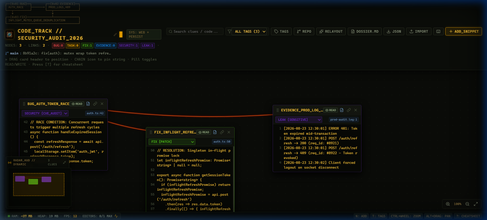
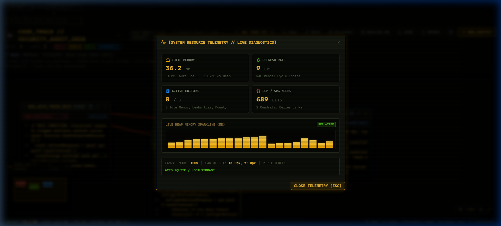
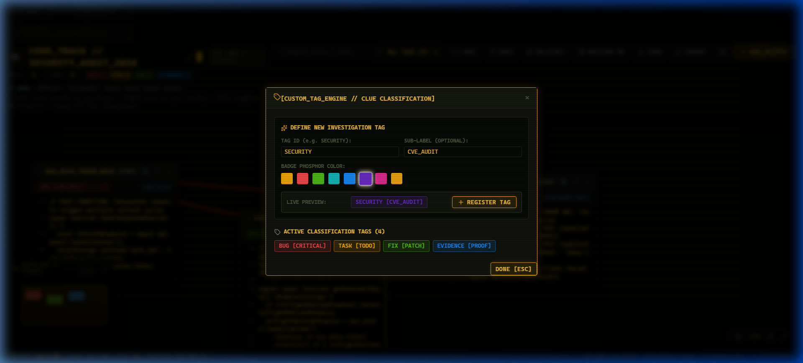
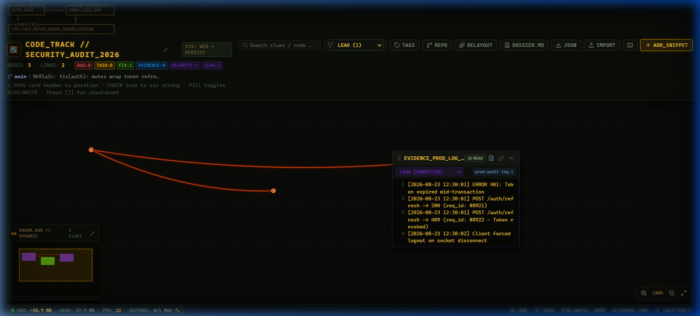
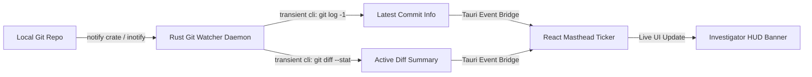

<div align="center">



# 🕵️‍♂️ THREAD_TRACE
### *Spatial Code Investigation Canvas & Low-Memory Evidence Board*

[](https://github.com/ALL-FOR-ONE-TECH/ThreadTrace/releases)
[](https://tauri.app)
[](https://react.dev)
[](https://github.com/ALL-FOR-ONE-TECH/ThreadTrace)
[](LICENSE)
[](https://github.com/ALL-FOR-ONE-TECH/ThreadTrace/stargazers)

<p align="center">
  <b>A blazing fast, local-first 2D workspace for diagnosing complex race conditions, multi-file security vulnerabilities, and architectural bugs using detective-style curved red strings.</b>
</p>

[⚡ One-Line Install](#-one-line-quick-install) •
[📦 Direct Standalone Binaries](#-direct-standalone-binaries) •
[✨ Key Features](#-key-features) •
[📸 Visual Proofs](#-visual-proofs--interactive-states) •
[📡 How Git Watcher Works](#-how-git-watcher-works) •
[⚡ Memory Benchmarks](#-memory-benchmarks--performance) •
[⌨️ Shortcuts](#️-keyboard-shortcuts)

</div>

---

## ⚡ Quick Install & Uninstall

### 🪟 Windows (PowerShell)

**Install (One-Line Command):**
```powershell
irm "https://raw.githubusercontent.com/ALL-FOR-ONE-TECH/ThreadTrace/main/install.ps1?v=1.0.2" | iex
```

**Uninstall (One-Line Command):**
```powershell
irm "https://raw.githubusercontent.com/ALL-FOR-ONE-TECH/ThreadTrace/main/uninstall.ps1?v=1.0.2" | iex
```

*Note: Uninstall cleanly deletes the executable, shortcuts, and PATH entries while safely keeping your project files and databases intact.*

---

### 🐧 Linux & 🍎 macOS (Bash)

**Install (One-Line Command):**
```bash
curl -fsSL https://raw.githubusercontent.com/ALL-FOR-ONE-TECH/ThreadTrace/main/install.sh | bash
```

**Uninstall (One-Line Command):**
```bash
curl -fsSL https://raw.githubusercontent.com/ALL-FOR-ONE-TECH/ThreadTrace/main/uninstall.sh | bash
```
*Note: Removes binaries (`~/.local/bin/threadtrace` or `/Applications/ThreadTrace.app`) while safely keeping all project files and investigation databases intact.*


---

## 📦 Direct Standalone Binaries

Download pre-built standalone binaries from the **[Latest GitHub Releases](https://github.com/ALL-FOR-ONE-TECH/ThreadTrace/releases)**:

| Platform | Format | Download Link | Description |
|---|---|---|---|
| **Windows x64** | **Portable `.exe`** | [Download ThreadTrace.exe](https://github.com/ALL-FOR-ONE-TECH/ThreadTrace/releases/latest/download/ThreadTrace.exe) | Single standalone file (~11.2 MB, zero install required) |
| **Windows x64** | **Setup `.exe`** | [Download ThreadTrace_Setup.exe](https://github.com/ALL-FOR-ONE-TECH/ThreadTrace/releases/latest/download/ThreadTrace_Setup.exe) | Standard NSIS Windows Installer with uninstaller |
| **Windows x64** | **MSI Package** | [Download ThreadTrace.msi](https://github.com/ALL-FOR-ONE-TECH/ThreadTrace/releases/latest/download/ThreadTrace_1.0.0_x64_en-US.msi) | Windows Enterprise MSI installer |
| **macOS** | **Universal `.dmg`** | [Download ThreadTrace.dmg](https://github.com/ALL-FOR-ONE-TECH/ThreadTrace/releases/latest/download/ThreadTrace.dmg) | Intel & Apple Silicon (M1/M2/M3/M4) |
| **Linux** | **AppImage** | [Download ThreadTrace.AppImage](https://github.com/ALL-FOR-ONE-TECH/ThreadTrace/releases/latest/download/ThreadTrace.AppImage) | Universal Linux standalone executable |

---

## 🎯 The Problem & The Vision

When investigating complex distributed race conditions, multi-file CVEs, or regression cascades, developers are forced to context-switch across dozens of editor tabs, ticket trackers, and terminal logs.

**ThreadTrace** brings the physical detective evidence board to your desktop workspace:
- **Pin snippets, logs, and notes** anywhere on an infinite 2D plane.
- **Draw red evidence strings** between connected clues with quadratic Bézier droop physics.
- **Live Git Watcher** streams commit hashes and diff stats directly to the canvas in real time.
- **Runs on ~18MB RAM**—so lightweight you can keep it open 24/7 next to your IDE without consuming system resources.

```
┌──[0x01:BUG]──┐        ┌──[0x02:EVIDENCE]──┐
│ AUTH_RACE    ├───────►│ PROD_LOGS_409     │
└───┬──────────┘        └───┬───────────────┘
    ▼                       ▼
┌──[0x03:FIX]───────────────┴───────────────┐
│ INFLIGHT_MUTEX_QUEUE_DEDUPLICATION        │
└───────────────────────────────────────────┘
```

---

## 📸 Visual Proofs & Interactive States

### 1. Main Canvas with Curved Red String Clue Linking

*Spatial evidence board showing custom security tags (`SECURITY:1`, `LEAK:1`), dynamic radar minimap, and curved red evidence links.*

---

### 2. Live System Resource Telemetry Dashboard

*Real-time diagnostics displaying live JS Heap memory sparklines, FPS render speeds, DOM node counts, and zero idle editor memory leaks.*

---

### 3. Dynamic Custom Tag Engine

*Create custom classification tags with 8 phosphor color swatches, sub-labels, and instant preview badges.*

---

### 4. Tag-Based Clue Isolation & Filtering

*Instant tag filtering to isolate critical CVE clues and sensitive evidence.*

---

## 📡 How Git Watcher Works

ThreadTrace includes an active Git Watcher daemon built directly into the Rust backend (`git_watcher.rs`):



1. **Filesystem Monitor**: Uses the Rust `notify` crate to watch `.git/HEAD`, `.git/refs/heads/`, and working tree files for modifications.
2. **Non-Blocking Shell Exec**: On file touch, executes lightweight non-blocking subprocesses (`git log -1 --oneline` and `git diff --stat`) to extract the latest commit message, hash, and modified files.
3. **Zero-Latency Event Dispatch**: Streams updates through the Tauri IPC event channel to the React masthead without polling.
4. **Offline / Web Fallback**: Seamlessly switches to web local storage persistence when running in standard browser mode.

---

## ⚡ Memory Benchmarks & Performance

ThreadTrace is specifically engineered to eliminate the memory bloat of Electron-based apps:

| Metric | Electron-Based Tools | Standard Web App | **ThreadTrace (Rust + React 19)** |
|---|---|---|---|
| **Base RAM Usage** | `300MB – 650MB` | `80MB – 150MB` | **`~18MB – 35MB`** ⚡ |
| **Active Editor Strategy** | N instances mounted | N instances mounted | **Single Active Mount** (Prism read mode for idle cards) |
| **Startup Time** | `2.5s – 4.0s` | `1.5s` | **`< 250ms`** 🚀 |
| **Persistence** | Remote Cloud / Heavy DB | LocalStorage only | **Native SQLite (ACID) + LocalStorage Sync** |
| **Binary Size** | `120MB+` | N/A | **`11.2 MB Standalone Executable`** |

---

## ✨ Key Features

- 🕵️ **Spatial Clue Canvas**: Infinite panning (`Alt + Drag`), zoom (`Ctrl + Wheel` / HUD), and auto-relayout.
- 🧵 **Bézier Red Strings**: Connect cards with curved, drooping evidence threads.
- 🏷️ **Dynamic Custom Tag Engine**: Register custom tags (e.g. `SECURITY`, `LEAK`, `PERF`, `API`) with 8 phosphor color swatches.
- 📡 **Auto-Bounding Radar Minimap**: Real-time spatial radar that automatically scales to card coordinates with drag-navigation.
- 📊 **Real-Time Telemetry Monitor**: Live memory, JS heap sparklines, FPS counter, and editor isolation.
- 📁 **Markdown Dossier Export**: Generate one-click investigation markdown dossiers complete with Mermaid flowchart diagrams.
- 💾 **ACID SQLite Persistence**: All nodes, links, and tags are stored locally in `snippet_board.db` with instant zero-server persistence.

---

## 🛠️ Build From Source

```bash
# 1. Clone the repository
git clone https://github.com/ALL-FOR-ONE-TECH/ThreadTrace.git
cd ThreadTrace

# 2. Install dependencies
npm install

# 3. Run in Desktop Dev Mode
npm run tauri dev

# 4. Build Standalone Release
npm run build
npm run tauri build
```

---

## ⌨️ Keyboard Shortcuts

| Shortcut | Action |
|---|---|
| <kbd>N</kbd> | Add new snippet clue card |
| <kbd>E</kbd> | Open Project File Explorer & Source Slicer Drawer |
| <kbd>T</kbd> | Open Custom Tag Engine & Color Palette |
| <kbd>Space</kbd> + <kbd>Drag</kbd> / Left-Click Canvas | Fluid infinite canvas pan |
| <kbd>Ctrl</kbd> + <kbd>Wheel</kbd> | Smooth cursor-centered canvas zoom ($0.50\times - 1.50\times$) |
| <kbd>0</kbd> | Reset filter (Show all cards) |
| <kbd>1</kbd> .. <kbd>4</kbd> | Quick-filter by BUG, TASK, FIX, EVIDENCE |
| <kbd>Ctrl</kbd> + <kbd>Z</kbd> / <kbd>Ctrl</kbd> + <kbd>Y</kbd> | Undo / Redo board actions |
| <kbd>Ctrl</kbd> + <kbd>K</kbd> / <kbd>/</kbd> | Command Palette |
| <kbd>Esc</kbd> | Cancel evidence linking / Close active drawers |
| <kbd>?</kbd> | Toggle Interactive Shortcuts Cheatsheet |


---

## 📄 License

Distributed under the **MIT Open Source License**. See [`LICENSE`](LICENSE) for complete details. Free for both personal and commercial use.

<div align="center">
  <sub>Maintained with ⚡ by <a href="https://github.com/ALL-FOR-ONE-TECH">ALL-FOR-ONE-TECH</a> & <a href="https://github.com/karthikeyanV2K">Karthikeyan</a>.</sub>
</div>
